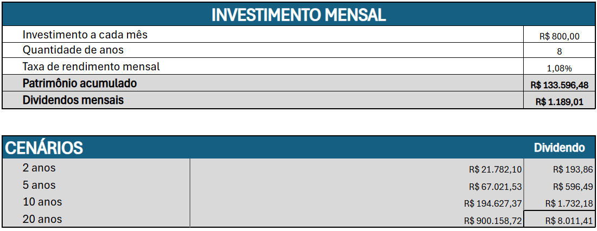

# Simulador de Investimentos em Fundos Imobiliários

## Introdução

O projeto em questão visa simular cenários de investimentos. O mesmo foi feito baseando-se no exemplo prático disponibilizado no módulo "Dominando Tabelas com Excel" do curso "Excel com Inteligência Artificial" ofertado pelo Santander em parceria com a DIO.

## Demonstrações

Para demonstrar o simulador, o mesmo foi dividido em três partes:

### Parte 01

Aqui há a parte inicial do simulador. O usuário deverá digitar seu salário e rendimento da carteira nos campos correspondentes e o simulador calculará um valor sugerido para que o usuário invista. Os campos com coloração acinzentada não deverão ser alterados pelo usuário pois são campos reservados ao simulador (esse padrão se repetirá durante todo o layout dessa aplicação).

### Parte 02

Essa parte da aplicação diz respeito às especificações de investimento. Os campos em branco são para que o usuário coloque as informações correspondentes. Os campos em cinza servem para, de acordo com as informações fornecidas pelo usuário, mostrar os devidos cálculos representados pelas colunas nomeadas.

### Parte 03

Essa é a parte final do simulador. Aqui, são apresentadas sugestões de investimento para cada tipo de perfil de investidor e de acordo com o aporte escolhido pelo usuário anteriormente. Os cálculos são feitos a partir de uma coluna de apoio, a qual foi ocultada.

## Considerações Finais

O projeto pode ser alterado posteriormente.
